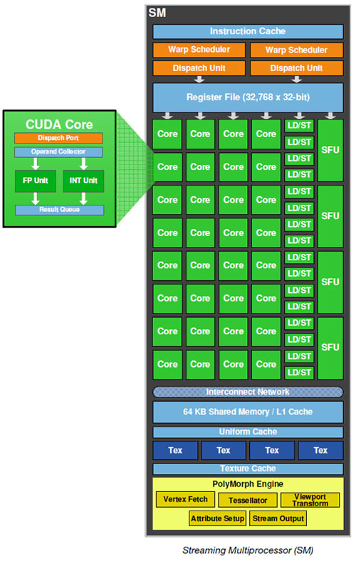
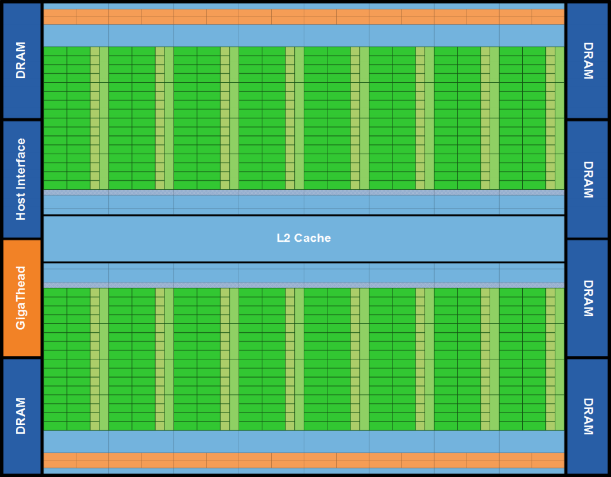

# Note (draft)
This note focuses on the hardware ascpect of the GPU. The data about the Fermi and Kepler
architecture are summized from the book _Professional CUDA C Programming_. I will add the 
data for Maxwell and Pascal architecture by myself.

## Specifications
CUDA uses Single Instrution Multiple Thread (SIMT) architecture. The main difference between 
SIMT and SIMD is that SIMT allows threads to execute different instructions while SIMD 
executes in a unified synchronous group.

## Basic structure
### Fermi architecture
I know, this is a piece of antiques in 2018.
- GPU 
	- Streaming Multiprocessors (SM)
		- Thread (CUDA core)
			- Interger arithmetic logic unit (ALU)
			- Floating-point unit (FPU)
		- Shared memory/L1 Cache 
		- Register file
		- Load/Store unit (LD/ST)
		- Special function unit (SFU)
		- Warp scheduler and dispatch unit

**Fermi SM**

**Fermi chip block**

