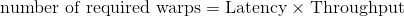
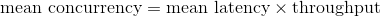

# Note
This note focuses on the latency and latency hiding.

## Latency and latency hiding
<dl>
	<dt>Instruction latency</dt>
	<dd>
		is the number of clock cycle it takes from the point that an instruction is issued to the point that the 
		instructionis completed.
	</dd>
</dl>

In order to fully consume the power of the GPU, one should make sure that for every clock cycle there exists an
eligible warp such that the warp scheduler can alway assign instructions to other warp without wating for the 
stalled warp. This is the latency hiding, and latency hiding is dependent on the active warps on a SM.

## Instructions
There are two types of instructions:
1. <dl>
		<dt>Arithmetic instructions</dt>
		<dd>
			The time it takes from the arithmic operation started to the result is calculated.
		</dd>
	</dl>
2. <dl>
		<dt>Memory instructions</dt>
		<dd>
			The time it takes from the data trasportation is issued to the transportation is completed.
		</dd>
	</dl>

## Little's law
The Little's law can be used to calculate the number of warps needed to achieve the latency hiding. The formula is

or

## Measurement metrics
In the arithmetic operations, one looke at the instruction latency per clock cycle and throughput to calculate 
the concurrency. The concurrency can therefore be expressed as either the number of operatoins or the number 
of warps.

For the memory instructions, one look a the amount of data transferd in a unit time, which is the bandwidth. Then
one can calculate the concurrency in terms of the memory operation or the number of warps.
