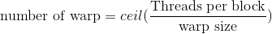

# Note
This note focuses on an important concept warp.

## Definition
A warp is a group of 32 threads in a same SM. A warp employs the SIMT architecture. That means all of the threads
in a same warp will execute the same instruction.

## Threads, block, and warp
Since warp contains 32 threads, the number of warp in a block can be calculated by the following formula:


where ceil is the ceiling function. It's important to note that if the threads number in a block is not a even multiple of warp size, there will be threads in
the block that stay inactive.

## Warp divergence
As mentioned above, the threads in a same warp follow the SIMT fasion. However,
if multiple instructions are applyed to a SM such that the threads execute 
different instructions, warp divergence will happen. Warp divergence will 
significantly affect the performance of an application, because the warp have to
run several times to execute branch. While the branch does not apply to some of 
the threads, the threads have to be inactive and wait for other threads. 
Divergence only happens within warp. This implys that we can assign different 
instructions to different warp without the cost of losing performance. Different
warps can execute different code with no penalty on performance.
For example, insteading of using:
```C++
__global__ void kernel()
{
	//something
	if(tid%2==0) 
		somthing;
	else 
		something;
	//something
}
```
we can use
```C++
__global__void kernel()
{
	//something
	if((tid/warpSize)%2==0)
		something;
	else
		something;
	//something
}
```
To investigate the performance of an application, we can use the `nvprof` 
command to retrive the information we are interested. For example, in this case
we are interested in the branch efficiency.
```bash
nvprof --metrics branch_efficiency ./application
```
The branch efficiency is calculated in the following way:


One can also use the `nvprof` tool to find the branch efficiency by typing:
```bash
nvprof --events branch,divergent_branch ./application
```

## Resource partitioning
There are three components of a the local execution context of a warp
- Program counters
- Registers
- Shared memory

The registers and shared memory are the most important and scarce resources on
a SM. The registers are distributed among threads while the shared memory is 
shared by the thread blocks. One can trade off the resources to increase the 
number of warp or number of thread block, vice versa.
If there are not enough registers and/or shared memory on a SM for at least one
block, the kernel will crash.
When the resources are allocated to a block, the block is called an active 
block. The warps inside an active block are called active warps. There are three types of warps:
- Selected warp: actively executing
- Eligible warp: ready but not executing
- Stalled warp: not ready for executing

Therefore, to maximize the performance of the GPU, one needs to keep a large amount of active warps.
